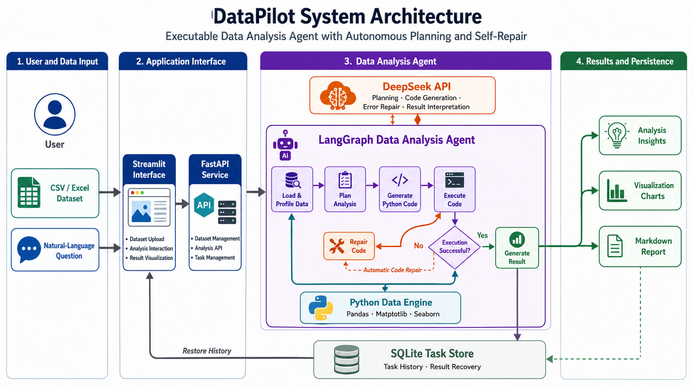
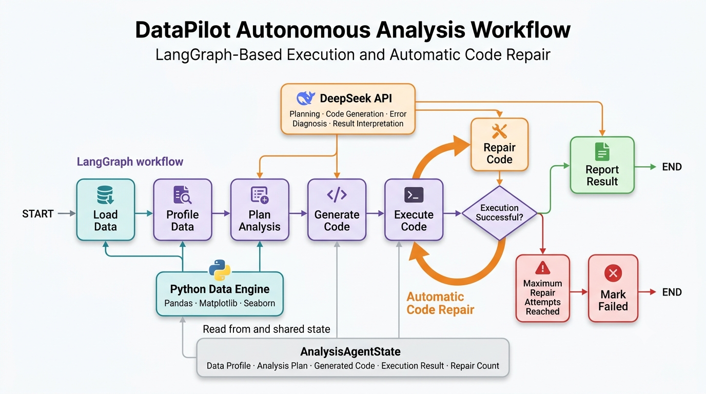

# DataPilot

> 具备自主规划、代码执行与错误修复能力的智能数据分析 Agent

DataPilot 是一个基于 **DeepSeek、LangGraph、Pandas、FastAPI 和 Streamlit** 构建的可执行智能数据分析 Agent。

用户上传 CSV 或 Excel 数据集后，只需使用自然语言描述分析需求，DataPilot 即可自动完成数据加载与画像分析、任务规划、Python 代码生成、代码执行、结果解释和图表生成。当生成的代码执行失败时，Agent 会根据错误信息自动修复代码并重新执行。

项目还支持数据集管理、任务历史持久化、历史结果恢复与删除，以及 Markdown 分析报告导出。

---

## 项目特点

- 使用自然语言提出数据分析需求
- 支持 CSV 和 Excel 数据集上传
- 自动识别数据字段、类型和基础统计信息
- 基于 DeepSeek 自动制定分析计划
- 自动生成 Pandas 数据分析代码
- 自动执行 Python 代码并捕获运行结果
- 自动生成 Matplotlib / Seaborn 可视化图表
- 基于 LangGraph 编排完整分析工作流
- 代码执行失败后自动诊断并修复
- 支持最大修复次数限制，防止无限循环
- 使用 SQLite 持久化分析任务
- 支持历史任务查询、恢复和删除
- 支持 Markdown 分析报告下载
- 提供 FastAPI 后端接口
- 提供 Streamlit 可视化交互界面

---

## 系统架构

<p align="center">
  
</p>

DataPilot 由以下核心部分组成：

- **Streamlit Interface**：负责数据上传、问题输入、结果展示和历史任务管理。
- **FastAPI Service**：提供数据集管理、分析任务和历史任务接口。
- **LangGraph Agent**：组织数据分析过程，并根据代码执行结果进行条件路由。
- **DeepSeek API**：完成分析规划、代码生成、错误修复和结果解释。
- **Python Data Engine**：使用 Pandas、Matplotlib 和 Seaborn 执行数据分析。
- **SQLite Task Store**：持久化保存分析任务及其执行结果。
- **Markdown Report Generator**：将分析结果转换为可下载的 Markdown 报告。

---

## Agent 工作流

<p align="center">
  
</p>

DataPilot 使用 LangGraph 将数据分析过程组织为一个带状态、条件分支和循环修复能力的工作流。

```text
START
  ↓
加载数据
  ↓
生成数据画像
  ↓
制定分析计划
  ↓
生成Python代码
  ↓
执行代码
  ↓
判断是否执行成功
  ├── 成功 → 生成分析报告 → END
  │
  └── 失败 → 修复代码 → 重新执行
                         │
                         └── 达到修复上限 → 标记失败 → END
```

完整工作流包含以下节点：

| 节点 | 功能 |
|---|---|
| `load_data` | 根据数据集 ID 加载 CSV 或 Excel 文件 |
| `profile_data` | 分析数据规模、字段类型、缺失值和统计信息 |
| `plan_analysis` | 根据用户问题和数据画像制定分析计划 |
| `generate_code` | 根据分析计划生成 Python 数据分析代码 |
| `execute_code` | 执行代码并收集输出、图表和异常信息 |
| `repair_code` | 根据执行错误诊断并修复代码 |
| `report_result` | 整理执行结果并生成自然语言结论 |
| `mark_failed` | 达到最大修复次数后记录失败原因 |

---

## 自动修复机制

普通的数据分析助手通常只负责生成代码，而 DataPilot 会进一步执行生成的代码，并根据运行结果决定下一步操作。

```text
生成代码
   ↓
执行代码
   ↓
是否成功？
   ├── 是 → 解释结果并生成报告
   │
   └── 否 → 获取错误信息
             ↓
           修复代码
             ↓
           重新执行
```

如果代码执行失败，系统会将以下信息交给 DeepSeek：

- 用户的原始问题
- 数据集画像
- 当前分析计划
- 执行失败的代码
- 标准错误输出
- 已执行的修复次数

DeepSeek 根据错误上下文生成修复后的代码，然后 LangGraph 将任务重新路由至执行节点。

当前默认最多允许修复：

```text
2 次
```

达到修复上限后，任务会被标记为失败，避免工作流无限循环。

---

## 使用示例

用户上传销售数据后，可以直接输入：

```text
分析不同地区的销售额差异，指出销售额最高和最低的地区，并生成柱状图。
```

DataPilot 会自动执行：

```text
读取数据集
→ 分析字段及数据类型
→ 制定分组汇总计划
→ 生成Pandas代码
→ 按地区汇总销售额
→ 生成柱状图
→ 解释最高和最低地区
→ 返回完整分析结果
```

还可以提出：

```text
分析不同产品类别的平均利润率，并按照利润率从高到低排序。
```

```text
分析最近六个月销售额的变化趋势，并生成折线图。
```

```text
比较各地区订单数量、销售额和平均客单价。
```

```text
找出销售额与利润之间的相关关系，并绘制散点图。
```

---

## 主要功能

### 1. 数据集上传与管理

DataPilot 支持上传：

- `.csv`
- `.xlsx`

上传后，系统会：

1. 保存原始数据文件。
2. 生成唯一的 `dataset_id`。
3. 解析数据集基本信息。
4. 注册数据集元数据。
5. 在前端数据集列表中展示。

数据集信息包括：

- 文件名
- 文件类型
- 文件大小
- 行数
- 列数
- 字段名称
- 字段类型

---

### 2. 自动数据画像

在正式分析前，DataPilot 会自动读取数据集并生成数据画像，包括：

- 数据集行数与列数
- 字段名称
- 字段数据类型
- 缺失值数量
- 数值字段统计信息
- 分类字段示例值
- 数据样例

数据画像会作为上下文提供给 DeepSeek，帮助模型理解真实的数据结构，降低生成错误字段名或错误分析代码的概率。

---

### 3. 自主分析规划

DataPilot 不会直接根据用户问题立即生成代码，而是先创建结构化分析计划。

例如：

```text
1. 检查地区和销售额字段
2. 按地区分组并汇总销售额
3. 对汇总结果进行排序
4. 找出最高和最低地区
5. 生成销售额柱状图
6. 总结不同地区之间的差异
```

这种“先规划、再执行”的方式能够提高复杂分析任务的稳定性和可解释性。

---

### 4. Python 代码生成与执行

DataPilot 根据以下信息生成代码：

- 用户问题
- 数据集路径
- 数据集画像
- 字段名称与类型
- 分析计划
- 输出要求

生成的代码主要使用：

- Pandas
- NumPy
- Matplotlib
- Seaborn

系统会执行生成的代码，并收集：

- 标准输出
- 错误信息
- 执行状态
- 执行耗时
- 生成图表
- 执行轨迹

---

### 5. 分析结果生成

代码执行成功后，DataPilot 会结合：

- 用户问题
- 分析计划
- 代码执行输出
- 统计结果
- 图表文件

生成自然语言分析结论。

最终结果可以包括：

- 核心统计结果
- 最高值和最低值
- 不同类别之间的差异
- 趋势变化
- 数据关系解释
- 可视化图表
- 生成的 Python 代码
- 代码说明

---

### 6. 历史任务持久化

DataPilot 使用 SQLite 保存分析任务。

每次分析完成后，系统会保存：

- 任务 ID
- 数据集 ID
- 用户问题
- 分析状态
- 分析计划
- 生成代码
- 代码说明
- 执行结果
- 修复次数
- 执行轨迹
- 最终答案
- 错误信息
- 创建时间

历史任务支持：

- 查询最近任务
- 查看完整任务详情
- 恢复历史分析结果
- 删除指定任务

任务数据库默认保存在：

```text
data/database/datapilot.db
```

---

### 7. Markdown 报告导出

分析完成后，可以从 Streamlit 页面下载 Markdown 报告。

报告包括：

- 任务基本信息
- 数据集信息
- 用户问题
- 分析计划
- 分析结论
- 代码说明
- 生成的 Python 代码
- 代码执行信息
- 错误信息

下载文件示例：

```text
datapilot-task-a2f91c.md
```

---

## 技术栈

| 模块 | 技术 |
|---|---|
| 大语言模型 | DeepSeek API |
| Agent 编排 | LangGraph |
| LLM 调用 | LangChain |
| 数据处理 | Pandas、NumPy |
| 数据可视化 | Matplotlib、Seaborn |
| 数据校验 | Pydantic |
| 后端接口 | FastAPI、Uvicorn |
| 前端界面 | Streamlit |
| 任务持久化 | SQLite |
| 数据格式 | CSV、Excel |
| 报告生成 | Markdown |
| 开发语言 | Python 3.11 |

---

## 项目结构

```text
DataPilot-Agent/
├── app/
│   ├── agent/
│   │   ├── analysis_agent.py
│   │   ├── code_executor.py
│   │   ├── code_generator.py
│   │   ├── code_repairer.py
│   │   ├── graph.py
│   │   ├── nodes.py
│   │   ├── planner.py
│   │   ├── reporter.py
│   │   └── state.py
│   ├── api/
│   │   └── main.py
│   ├── core/
│   │   ├── config.py
│   │   └── llm.py
│   ├── data/
│   │   ├── loader.py
│   │   ├── manager.py
│   │   └── profiler.py
│   ├── report/
│   │   ├── __init__.py
│   │   └── markdown_report.py
│   ├── schemas/
│   │   ├── analysis.py
│   │   └── dataset.py
│   └── storage/
│       └── task_store.py
├── assets/
│   ├── framework.png
│   └── workflow.png
├── data/
│   ├── artifacts/
│   ├── database/
│   ├── outputs/
│   └── uploads/
├── frontend.py
├── requirements.txt
├── .env.example
├── .gitignore
└── README.md
```

> 如果你的实际文件名与上述目录略有不同，请以本地项目为准修改这一部分。

---

## 环境要求

推荐环境：

- Python 3.11
- Conda
- Linux
- DeepSeek API Key

项目的数据处理部分可以直接在 CPU 环境运行，不需要 GPU。

---

## 安装方法

### 1. 克隆项目

```bash
git clone https://github.com/chenqianqian-k/DataPilot-Agent.git
cd DataPilot-Agent
```

### 2. 创建 Conda 环境

```bash
conda create -n datapilot python=3.11 -y
conda activate datapilot
```

### 3. 安装依赖

```bash
pip install -r requirements.txt
```

---

## 配置环境变量

复制示例环境变量：

```bash
cp .env.example .env
```

编辑：

```bash
nano .env
```

填写 DeepSeek 配置：

```env
DEEPSEEK_API_KEY=your_deepseek_api_key
DEEPSEEK_BASE_URL=https://api.deepseek.com
DEEPSEEK_MODEL=deepseek-chat
```

如果使用其他兼容 OpenAI API 格式的模型服务，可以修改：

```env
DEEPSEEK_BASE_URL=https://your-api-provider.example.com/v1
DEEPSEEK_MODEL=your-model-name
```

请勿将真实 `.env` 文件上传到 GitHub。

---

## 启动项目

需要分别启动 FastAPI 后端和 Streamlit 前端。

### 1. 启动 FastAPI

```bash
uvicorn app.api.main:app \
    --host 0.0.0.0 \
    --port 6016
```

启动后访问：

```text
http://localhost:6016
```

FastAPI 接口文档：

```text
http://localhost:6016/docs
```

### 2. 启动 Streamlit

新开一个终端：

```bash
conda activate datapilot
cd DataPilot-Agent
```

启动前端：

```bash
streamlit run frontend.py \
    --server.address 0.0.0.0 \
    --server.port 6018
```

启动后访问：

```text
http://localhost:6018
```

---

## API 接口

| 方法 | 路径 | 功能 |
|---|---|---|
| `GET` | `/` | 服务基本信息 |
| `GET` | `/health` | 服务健康检查 |
| `POST` | `/datasets/upload` | 上传并注册数据集 |
| `GET` | `/datasets` | 查询数据集列表 |
| `POST` | `/analysis` | 执行数据分析任务 |
| `GET` | `/tasks` | 查询历史分析任务 |
| `GET` | `/tasks/{task_id}` | 查询完整任务结果 |
| `DELETE` | `/tasks/{task_id}` | 删除指定历史任务 |

完整接口及请求参数可以在 FastAPI 文档中查看：

```text
http://localhost:6016/docs
```

---

## API 调用示例

### 查询数据集

```bash
curl http://127.0.0.1:6016/datasets
```

### 发起分析

首先从 `/datasets` 获取数据集 ID，然后执行：

```bash
curl -X POST "http://127.0.0.1:6016/analysis" \
  -H "Content-Type: application/json" \
  -d '{
    "dataset_id": "your_dataset_id",
    "question": "分析不同地区的销售额差异，并生成柱状图。"
  }'
```

### 查询历史任务

```bash
curl "http://127.0.0.1:6016/tasks?limit=20"
```

### 查询指定任务

```bash
curl \
  "http://127.0.0.1:6016/tasks/your_task_id"
```

### 删除指定任务

```bash
curl -X DELETE \
  "http://127.0.0.1:6016/tasks/your_task_id"
```

---

## 核心数据流

```text
用户上传数据集
        ↓
DatasetManager保存并注册数据集
        ↓
用户使用自然语言提出问题
        ↓
FastAPI接收分析请求
        ↓
DataAnalysisAgent初始化State
        ↓
LangGraph执行分析工作流
        ↓
DeepSeek制定计划并生成代码
        ↓
Python执行器运行分析代码
        ↓
成功：生成结论、图表和报告
失败：自动修复代码并重新执行
        ↓
AnalysisResponse返回前端
        ↓
SQLite保存历史分析任务
```

---

## LangGraph State

工作流中的各个节点通过共享的 `AnalysisAgentState` 传递数据。

State 中主要保存：

- `task_id`
- `dataset_id`
- `file_path`
- `question`
- `data_profile`
- `plan`
- `generated_code`
- `current_code`
- `code_explanation`
- `execution`
- `repair_count`
- `max_repair_attempts`
- `execution_trace`
- `answer`
- `status`
- `error_message`

每个节点从 State 中读取所需信息，并返回需要更新的字段。

例如：

```text
plan_analysis
读取：question、data_profile
写入：plan

generate_code
读取：question、data_profile、plan
写入：current_code、code_explanation

execute_code
读取：file_path、current_code
写入：execution、execution_trace

repair_code
读取：current_code、execution、repair_count
写入：current_code、repair_count
```

---

## 项目亮点

### 自主规划

Agent 会先理解数据结构和用户需求，再生成结构化分析计划，而不是直接生成代码。

### 可执行分析

系统不仅返回代码，还会实际运行代码并收集分析结果和图表。

### 自动错误修复

代码执行失败时，LangGraph 会将任务路由至代码修复节点，然后重新执行。

### 状态驱动工作流

使用 `AnalysisAgentState` 在不同节点之间传递任务数据，使分析过程可追踪、可扩展。

### 任务持久化

使用 SQLite 保存完整分析结果，支持服务重启后查询和恢复历史任务。

### 前后端分离

使用 FastAPI 提供后端接口，Streamlit 提供交互式前端，便于继续扩展其他客户端。

---

## 数据安全

以下内容不会提交到 GitHub：

- `.env` 中的真实 API Key
- 用户上传的 CSV 或 Excel 文件
- SQLite 任务数据库
- Agent 生成的图表和临时文件
- Python 缓存文件
- 服务运行日志

上传代码前仍建议检查：

```bash
git status
```

并确认以下文件未被提交：

```text
.env
*.db
*.sqlite
data/uploads/*
data/database/*
data/artifacts/*
data/outputs/*
```

---

## 安全说明

DataPilot 会执行大模型生成的 Python 代码。

当前代码执行模块主要面向：

- 本地开发环境
- 个人项目演示
- 可信数据分析场景

当前版本不建议直接部署为任何人都可以访问的公开在线服务。

在公开部署之前，需要进一步增加：

- Docker 或其他容器级隔离
- CPU 与内存资源限制
- 文件系统访问限制
- 网络访问限制
- 危险模块导入拦截
- 系统命令调用拦截
- 代码执行超时与进程回收
- 用户身份认证和权限隔离

---

## 当前限制

- 当前仅支持 CSV 和 Excel 数据集。
- 分析效果依赖数据字段质量与用户问题描述。
- DeepSeek API 属于外部服务，需要用户自行配置。
- 复杂分析任务可能需要多次代码修复。
- 当前代码执行环境不等同于生产级安全沙箱。
- 当前主要面向单机和个人使用场景。
- 暂不支持多数据集关联分析。
- 暂不支持用户登录与多用户任务隔离。

---

## 后续计划

- [ ] 增加数据质量自动检查
- [ ] 检测缺失值、重复值和异常值
- [ ] 支持用户确认后执行数据清洗
- [ ] 支持清洗前后数据对比
- [ ] 支持多数据集关联分析
- [ ] 支持连续追问与上下文分析
- [ ] 增加容器化代码执行沙箱
- [ ] 增加 CPU、内存和运行时间限制
- [ ] 增加分析过程流式输出
- [ ] 增加 PDF 和 HTML 报告导出
- [ ] 增加自动化测试与 Agent 评估
- [ ] 增加 Docker 部署支持
- [ ] 增加多用户身份与任务隔离

---

## 简历项目描述

**DataPilot：具备自主规划、代码执行与错误修复能力的智能数据分析 Agent**

基于 DeepSeek、LangGraph、Pandas、FastAPI 和 Streamlit 构建可执行智能数据分析 Agent，支持 CSV/Excel 数据上传与自动画像，并根据自然语言问题自主完成分析规划、Python 代码生成、代码执行、结果解释和图表生成。基于 LangGraph 构建条件路由与自动修复工作流，在代码执行失败时结合异常信息进行诊断、修复和重试；使用 SQLite 持久化分析任务，支持历史结果恢复、删除及 Markdown 报告导出。

---

## License

本项目主要用于个人学习、技术实践和求职项目展示。

如需用于生产环境，请进一步完善代码执行隔离、安全认证和资源限制机制。
